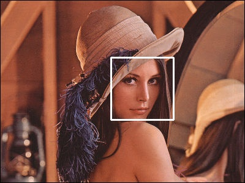

# OpenCV face detector

OpenCVを使用してMacbookのインカメラを起動し、顔認識を行います。



本プロジェクトでは、以下のソースを用意しています。

FILE | DESCRIPTION
-- | --
open_cv_detect_faces.py | OpenCVを使用した顔認識
                        | 顔を認識すると白色の枠で囲む
detect_faces.py | AmazonRekognition APIを使用した顔認識
                | 顔の認識に加えて、「笑顔」「感情」などの情報を取得する
detact_label.py | AmazonRekognition APIを使用した画像分類
                | 画像に写っている物体を認識する


以下のgifはdetect_faces.pyを実行した例です。
笑顔を検知すると緑色に、それ以外だと赤色の枠が顔を囲います。


# Setting
事前にpython3の環境を用意して置きましょう。
python3のモジュールであるvenvを使用すると閉じたpython3環境を作ることができます。

```
$ python3 -m venv .venv
$ . .venv/bin/activate
```

以下のpip insatllによって.vnenv/lib配下にパッケージがインストールされます。

```
(.vnenv) $ pip install -r requirements.txt
```

# Run

起動方法は簡単です。
```
$ python open_cv_detect_faces.py
...<インカメラ起動>
...<終了したいときは`q`を押す>
```
